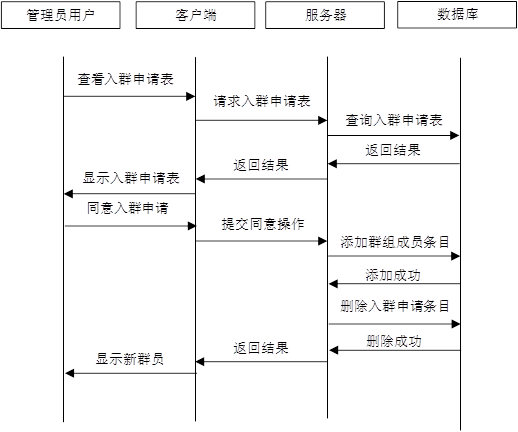

# 基于sockets的在线聊天软件的设计和开发   C# WPF   WinForm  

  

​            

​            

  

  

​            

​            

​            

## 3.1 系统总体设计

### 3.1.1 系统总体功能设计

  服务器端分为三个模块进行开发：建立链接模块、指令解析模块以及数据库交互模块。

  客户端为了提供易懂的操作，需要有一个主界面和多个子界面，并将用户级功能集成到这些子界面中。主界面应拥有支持系统用户功能的底层功能，包括建立链接功能、指令解析功能和子界面的调度功能。用户级功能被分别实现于子界面中，客户端应包含能实现如下功能的子界面：

  (1) 登录注册模块：实现账户的登录和注册；

(2) 好友与群组列表：显示好友和群组的列表；

(3) 个人信息模块：显示和修改个人信息；

  (4) 系统消息模块：显示发出和收到的好友申请和入群申请，并能够对这些申请进行一些操作；

  (5) 发送申请模块：通过该界面对用户发出好友申请或对群组提出入群申请；

  (6) 单人聊天：通过该界面和好友进行一对一聊天；

  (7) 多人聊天：通过该界面进行群组多人聊天。

  系统功能模块图如图3-1所示。

### 3.1.2 服务器端功能模块设计

  (1) 建立链接模块设计

  该模块用于建立和客户端的链接，在服务器端启动时建立一个监听用套接字，新上线的客户端通过向该套接字发出请求来实现与服务器的链接。当有新的客户端发起链接请求时，创建一个新的套接字用于和该客户端的套接字组成套接字对，并创建一个网络流，服务器端可以通过对该网络流进行读和写来实现与客户端的数据传输。

  (2) 指令解析模块设计

  该模块将客户端发送来的信息转化为字符串并进行解析，并根据解析出的不同结果进行不同操作，如对从数据库中获取数据、更新数据库中的数据、向其他在线客户端发送消息、向该客户端返回消息等。

  (3) 数据库交互模块设计

  该模块可以在关系型数据库和服务器端应用程序之间建立链接，使服务器端能够对数据库中储存的数据进行查询和更新，从而满足整个软件系统运行的数据需求。

 

图3-1 系统功能模块图

 

### 3.1.3 客户端功能模块设计

  (1) 登录与注册模块设计

  用户的注册：用户输入合法的账号和昵称，并输入两次相同的密码，当想注册的账号已经存在时会返回账号已存在信息，当两次密码输入不一致时会提示两次密码不一致并注册失败。输入全部合法时注册成功。

  用户的登录：用户输入账号和密码进行系统登录，账号和密码输入正确时进入系统主界面。

  (2) 主界面后台功能

  建立链接功能：客户端登录成功后创建一个套接字，并向服务器的监听端口发出链接请求，得到服务器的建立链接的回复后，与服务器提供的套接字形成一个套接字对以创建链接，并创建一个网络流用于与服务器进行数据交互。

  指令解析功能：客户端将服务器端发送来的信息转化为字符串并进行解析，并根据解析的结果做出操作，如修改客户端运行内存中的数据、将处理后的结果显示在界面中等。

  子界面的调度功能：该系统登录后会打开一个主界面，当主界面被关闭时客户端下线。客户端的功能被分别实现在各个子窗口中，子窗口可以通过操作主窗口的控件来打开，客户端应保证子窗口的打开和关闭能够正确进行，每个打开的子窗口能够准确获取到其功能所需的数据，并在其关闭后予以释放，每个子窗口的操作不应影响到其他窗口。

  (3) 系统消息模块

  系统消息包括收到的好友申请、收到的入群申请、己方已发送但未被处理的好友申请和入群申请。在此模块可以列表查看以上申请消息，并可以进行一些操作。收到的请求可以选择同意和拒绝，发出的申请消息可以撤销。对于好友申请，选择同意时，需要选择将其放入哪个好友分组，选择同意后，该用户会成为你选定分组下的好友；选择拒绝时，对方的已发出好友申请列表会删除本条申请信息，并且双方不会成为好友。对于群组申请，同意入群申请后，对方会成为该群聊成员，并可通过其客户端进入群组进行多人聊天；拒绝时，对方的已发出入群申请列表中会删除本条申请消息，并且不会加入该群聊。

  (4) 发送申请模块

  通过该模块可以发送好友申请和入群申请，申请时，需要输入想要成为好友的用户或向加入的群的编号，并选择想要加入的好友分组或群组分组。当该编号不存在时会返回该用户或群组不存在的消息，当输入的编号合法，则会在自己系统消息中的已发出好友申请或入群申请列表中添加一条申请条目。

  (5) 群组管理模块

  通过该模块可以管理自己创建和管理的群。用户可以创建自己的群组，并在该群组拥有群主权限，群组权限分为群主、管理员和普通群员。群主和管理员可以在系统消息模块对用户的入群申请进行批准和拒绝，也可以将群员踢出群聊。群主还可以设定和取消群聊用户的管理员权限，或者将群转让给其他用户，群主拥有解散群组的权限。

  (6) 单人聊天模块

  用户可以和作为好友的用户进行一对一文字聊天，用户在线时，如果有好友发送消息，则会有提示消息。用户离线时收到的好友聊天信息可以在上线后进行接受和查看。

  (7) 多人聊天模块

  用户可以在加入的群组中进行多人聊天，如果有群员发送消息，则所有在线群员会收到提示消息，并且离线的群员也可以在上线后对未读聊天记录进行接受和查看。

## 3.2 建立对象模型

  实体-关系图(E-R图)是用于描述实体、属性和关系等概念的工具。系统的对象模型在系统的设计过程中体现在对数据的进一步细化，更加清晰的表现出其有那些属性，各个实体之间又有怎样的关系。在本项目中，所有实体的关系图如图3-2所示。

 

图3-2 总体E-R图

 

### 3.2.1 用户实体  

  用户是使用该即时通讯系统进行操作的基本单位，其需具有唯一性，用户实体包含以下属性：

​    (1) UID：账户的唯一标识符，一个UID对应一个唯一的账户；

  (2) 账号、密码：作为账户登录时的身份认证；

  (3) 昵称：用户自定义的在客户端显示的名字；

  (4) 个人简介：自己编辑的一段用于自我介绍的字符串；

  (5) 好友分组、群聊分组：该账户拥有的好友和群聊分组名称，用户的好友和群聊必须放在一个分组中。

  用户实体的E-R图如图3-3所示。

图3-3 用户实体属性

 

### 3.2.2 群组实体 

  群组是特定的一组用户进行聊天的基本单位，不同的群组成员和管理者也不同，群组实体包含以下属性：

  (1) GID：群组的唯一标识符，一个GID对应一个唯一的群组；

  (2) 群组名称：群组在客户端中显示的名称；

  (3) 群组简介：群组的介绍信息；

  (4) 创建者：创建该群用户的UID。

  群组实体的E-R图如图3-4所示。

 

图3-4 群组实体属性

### 3.2.3 用户间关系 

  该系统中的各项功能均建立在用户之间的互动上，用户之间交流会产生数据，因此需要设计用户之间的关系来保存这些产生的数据，用户之间的关系包括以下几种：好友、申请和聊天记录。 

  下面对这几种用户间关系分别进行介绍。.

  (1) 好友关系

  用户可以和自己好友列表中的用户进行一对一聊天，好友关系保存在好友表中，好友关系包含如下属性。

  ① 分组名：用户将好友进行分组，每一个好友都有一个对应的分组组名。

  好友关系如图3-5所示。

 

图3-5 好友关系图

(2) 好友申请关系

  用户可以向其他不是好友的用户发出好友申请，并保存在申请表中。申请关系包含以下属性。

  ① 申请分组名：当对方用户同意该好友申请时，其会出现在好友列表中，此时他所在的好友分组就是申请好友时设定的申请分组名。

  申请关系如图3-6所示。

 

图3-6 申请关系图

  (3) 聊天记录关系

  用户与用户进行一对一聊天时聊天记录保存在服务器中，用户和用户实体之间拥有聊天记录关系，聊天记录表中包含如下属性。

  ① 已读标记：表示该条记录已经被读取，只有目标用户打开与发送用户的聊天窗口后才会将聊天记录条目标为已读；

  ② 发送时间：表示该聊天记录条目发送的时间；

  ③ 聊天内容：表示发送的聊天内容的主体。

  聊天记录关系如图3-7所示。

图3-7 聊天记录关系图

### 3.2.4 用户与群组间关系 

  群组与用户之间的关系有以下三种。

  (1) 成员关系

  属于该群组的用户会保存在成员关系中，群组的成员包含以下属性。

  ① 权限：权限分为三种，群主、管理员、普通群员，拥有不同权限的用户在一些群组管理功能中有不同的操作权限；

  ② 分组：用户将群组放置的分组；

  ③ 入群时间：用户加入群聊的时间；

  ④ 关闭窗口时间：用户关闭群聊窗口的时间，以这个时间为基准来判断那些消息是未读信息。

  成员关系如图3-8所示。

图3-8 成员关系图

  (2) 入群申请关系

  用户向群提交入群申请，并保存在入群申请表中。入群申请关系拥有以下属性。

  ① 申请群分组名：当管理员或群组同意该入群申请时，该群会出现在自己的群组列表中，此时这个群所在的群分组就是申请入群时设定的申请群分组名。

  入群申请关系如图3-9所示。

 

图3-9 入群申请关系图

 

  (3) 群聊记录

  群成员进行聊天，会将聊天记录储存在群聊记录表中。群聊记录拥有以下属性：

  ① 发送时间：群聊记录条目被发送的时间；

  ② 聊天内容：群聊记录内容主体。

  群聊记录关系如图3-10所示。

 

图3-10 群聊记录关系图

 

## 3.3 建立动态模型

  通过为本系统的主要功能模拟脚本和事件跟踪图，可以使得程序内部业务逻辑更加清晰，下面将对本系统正常运行时进行一次完整功能的操作流程进行模拟，并生成事件跟踪图。本文通过设计登录、申请好友、在线一对一聊天、同意好友申请、申请入群、同意入群申请、在线群组聊天等事件设计了以下事件跟踪图。

 

​    图3-11 登录事件跟踪图

 

图3-12 申请好友事件跟踪图

图3-13 同意好友申请事件跟踪图

 

 

图3-14 向在线好友发送一对一聊天信息事件跟踪图

图3-15 申请入群事件跟踪图

 

图3-16 同意入群申请事件跟踪图

 

图3-17 在线群组聊天事件跟踪图

 

## 3.4 建立功能模型

  本系统中，信息的来源和最终接收者均为用户，通过分析本系统中功能所产生的数据，可以总结出系统数据流的走向，如图3-18所示。

 

图3-18 局域网聊天系统基本系统模型

 

通过对系统数据流进行更深层次的细化分析，可以得到以下三个不同的功能级数据流图：

 

图3-19 好友功能数据流图

 

图3-20 群组功能数据流图

